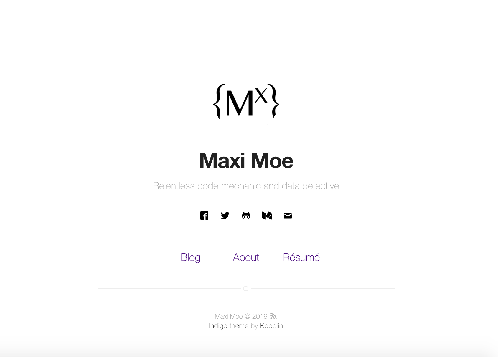

<p align="center">
    <h2 align="center"> <a href="https://mxnkpl.com/blog/"> Max's Blog</a> </h2>
    <h2 align="center"> made on Indigo Jekyll Template </h2>
</p>

<p align="center">"Quick-Launch" Blog powered by the <a href="https://github.com/sergiokopplin/indigo/">Indigo</a>
theme on
<a href="https://jekyllrb.com"> Jekyll</a>
<h3 align="center">Blog Author: <a href="https://mxnkpl.com"> Max Nakpil </a></h3>
</p>


***

<p align="center">
    <b><a href="README.md#blog">About Max's Blog</a></b>
    |
    <b><a href="README.md#m">Max's Website</a></b>
    |
    <b><a href="README.md#about-indigo">About Indigo & Jekyll</a></b>
    |
    <b><a href="README.md#setup">Setup</a></b>
</p>

<p align="center">
    
</p>

## Blog

<a href="https://mxnkpl.com/blog/"> Max's Blog:</a>

Covers the growing pains of a Software Engineer. A tool to cradle any interests in Machine Learning, Data Science and Ethical Data && directory of resources to help defeat Math-phobia.

## Max's Full Website?

Check<a href="https://mxnkpl.com"> Max's Full Website</a> for more projects and information on author.

## About Indigo & Jekyll

- [Jekyll](https://jekyllrb.com/), [Sass](http://sass-lang.com/) ~[RSCSS](http://rscss.io/)~ and [SVG](https://www.w3.org/Graphics/SVG/)
- Tests with [Travis](https://travis-ci.org/)
- Google Speed: [98/100](https://developers.google.com/speed/pagespeed/insights/?url=http%3A%2F%2Fsergiokopplin.github.io%2Findigo%2F);

## Setup
To use Indigo Theme:
0. :star: to the project. :metal:
2. Fork the project [Indigo](https://github.com/sergiokopplin/indigo/fork)
3. Edit `_config.yml` with your data (check <a href="README.md#settings">settings</a> section)
4. Write some posts :bowtie:

If you want to test locally on your machine, do the following steps also:

1. Install [Jekyll](https://jekyllrb.com/docs/), [NodeJS](https://nodejs.org/) and [Bundler](http://bundler.io/).
1a. Fork the project [Indigo](https://github.com/sergiokopplin/indigo/fork)
2. Clone the forked repo on your machine
3. Enter the cloned folder via terminal and run `bundle install`
4. Then run `bundle exec jekyll serve --config _config.yml,_config-dev.yml`
5. Open it in your browser: `http://localhost:4000`
6. Test your app with `bundle exec htmlproofer ./_site`
7. Do you want to use the [jekyll-admin](https://jekyll.github.io/jekyll-admin/) plugin to edit your posts? Go to the admin panel: `http://localhost:4000/admin`. The admin panel will not work on GitHub Pages, [only locally](https://github.com/jekyll/jekyll-admin/issues/341#issuecomment-292739469).

You must fill some informations on `_config.yml` to customize your site.

```
name: John Doe
bio: 'A Man who travels the world eating noodles'
picture: 'assets/images/profile.jpg'
...

and lot of other options, like width, projects, pages, read-time, tags, related posts, animations, multiple-authors, etc.
```

---
Indigo Theme © :
[MIT](http://kopplin.mit-license.org/) License © Sérgio Kopplin
